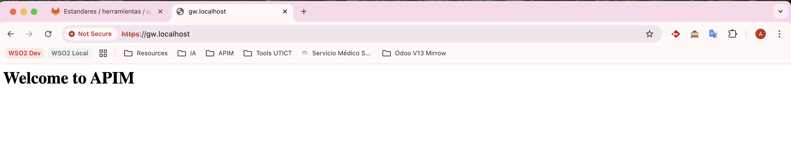

- [WSO2 API Manager with NGINX Reverse Proxy](#wso2-api-manager-with-nginx-reverse-proxy)
  - [Purpose](#purpose)
  - [Prerequisites](#prerequisites)
  - [Repository Structure](#repository-structure)
  - [Setup Instructions](#setup-instructions)
  - [Customize the configuration (OPTIONAL)](#customize-the-configuration-optional)
  - [Configuration Details](#configuration-details)
- [Portals](#portals)
- [Known Issues](#known-issues)
  - [Failed to fetch](#failed-to-fetch)
  - [Unclassified Authentication Failure](#unclassified-authentication-failure)

# WSO2 API Manager with NGINX Reverse Proxy

This repository contains the configuration files and instructions to set up a WSO2 API Manager (APIM) with an NGINX reverse proxy. The purpose of this setup is to ensure that the internal URLs of the WSO2 APIM are not exposed to the public, and all traffic is routed through the NGINX reverse proxy.

## Purpose

The main goal of this repository is to provide a secure and efficient way to manage API traffic using WSO2 API Manager, while hiding the internal URLs and ports behind an NGINX reverse proxy. This setup ensures that users only interact with the public-facing URLs, enhancing security and simplifying URL management.

## Prerequisites

- Docker
- Docker Compose

## Repository Structure

```
├── nginx/
│   ├── conf.d/
│   │   └── nginx.conf     # NGINX configuration for reverse proxy
│   └── ssl/
│       ├── selfsigned.crt # Self-signed certificate for HTTPS
│       └── selfsigned.key # Private key for SSL certificate
├── wso2/
│   └── conf/
│       └── deployment.toml # WSO2 API Manager configuration file
├── docker-compose.yml     # Docker compose configuration
├── LICENSE                # License file
├── README.md              # This documentation file
└── CONTRIBUTING.md        # Guidelines for contributing
```

## Setup Instructions

**1. Update your local DNS or `/etc/hosts` file**
To ensure that the domain names `apim.localhost` and `gw.localhost` resolve to your local machine, you need to update your local DNS settings or the `/etc/hosts` file. This allows you to access the WSO2 API Manager and the NGINX reverse proxy using these domain names instead of IP addresses.
```sh
127.0.0.1       apim.localhost
127.0.0.1       gw.localhost
```

**2. Clone the Repository**
```sh
git clone ssh:.../wso2am-nginx-proxy.git
cd wso2am-nginx-proxy
```

**3. Configure SSL Certificates**
Generate a self-signed SSL certificate or use your own SSL certificate. If you choose to generate a self-signed certificate, you can use the following command:
```sh
openssl req -x509 -nodes -days 365 -newkey rsa:2048 \
  -keyout ./nginx/ssl/selfsigned.key -out ./nginx/ssl/selfsigned.crt \
  -subj "/C=MX/ST=CDMX/L=México City/O=wso2.com/OU=IT/CN=apim.localhost"
```

**4. Start the containers using Docker Compose**
Run the following command to start the containers:
```sh
docker compose up -d --build
```

**5. Access the Services**
- Admin Portal: [https://apim.localhost/admin]
- Publisher Portal: [https://apim.localhost/publisher]
- Developer Portal: [https://apim.localhost/devportal]
- Carbon Console: [https://apim.localhost/carbon]
- Gateway: [https://gw.localhost]

## Customize the configuration (OPTIONAL)
You can update configuration files of NGINX and WSO2 API Manager according to your needs. Below are the configurations you can update:

> **Self-signed SSL certificate**:
> - The command above generates a self-signed certificate and key.
> - The certificate is valid for 365 days and can be customized with your organization's details.
> - Customize the `-subj` values (`/C`, `/ST`, `/L`, `/O`, `/OU`, `/CN`) to match your organization's details and location.

> **nginx.conf**:
> - Replace `apim.localhost` with your desired domain name.
> - Update the SSL certificate and key paths to match the generated or provided certificates.

> **deployment.toml**:
> - Set the `hostname` property under `[server]` to match your public-facing domain (e.g., `apim.localhost`).


## Configuration Details

**NGINX Configuration**
The NGINX configuration file (nginx/conf.d/nginx.conf) is set up to forward requests to the WSO2 API Manager while hiding the internal URLs and ports. It uses proxy_redirect and sub_filter directives to ensure that all internal URLs are replaced with the public-facing URLs.

**WSO2 API Manager Configuration**
The deployment.toml file is configured to use apim.localhost as the hostname. This ensures that all internal references within WSO2 APIM use the public-facing URL.

**Docker Compose**
The compose.yml file sets up two services:

- wso2_apim: The WSO2 API Manager container.
- nginx: The NGINX reverse proxy container.

**Troubleshooting**
If you encounter any issues, check the logs for both the NGINX and WSO2 APIM containers:
```sh
docker compose logs nginx
docker compose logs wso2_apim
```

**License**
This project is licensed under the MIT License. See the [LICENSE](./LICENSE) file for details.
**License**
This project is licensed under the MIT License. See the LICENSE file for details.

**Contributing**
Contributions are welcome! Please refer to the [CONTRIBUTING.md](CONTRIBUTING.md) file for detailed guidelines. You can also open an issue or submit a pull request for any improvements or bug fixes.

# Portals

The WSO2 API Manager consists of several web interfaces, all accessible through the NGINX reverse proxy:
The default password for the admin user is `admin` and the username is `admin`.

- **Admin Portal**: [https://apim.localhost/admin](https://apim.localhost/admin) - For API administration and governance tasks, such as managing users, roles, and permissions, and monitoring API usage.
- **Publisher Portal**: [https://apim.localhost/publisher](https://apim.localhost/publisher) - For API creation, documentation, and lifecycle management, including defining API resources, policies, and publishing APIs.
- **Developer Portal**: [https://apim.localhost/devportal](https://apim.localhost/devportal) - For discovering, subscribing, and testing APIs, allowing developers to explore available APIs and integrate them into their applications.
- **Carbon Console**: [https://apim.localhost/carbon](https://apim.localhost/carbon) - For server administration, such as configuring system settings, managing tenants, and monitoring server health.

# Known Issues
## Failed to fetch
  

  >Understanding the error message:
  >The net::ERR_CERT_AUTHORITY_INVALID error indicates that your browser does not trust the security certificate presented by the server at https://gw.localhost. This typically happens because the certificate is either self-signed, expired, or issued by an authority that your browser does not recognize as valid.

  To resolve this issue, you can do the following:
  - Add an exception in your browser to trust the self-signed certificate. This is done automatically when you access the URL https://gw.localhost/ for the first time and click the link "Proceed to gw.localhost (unsafe)."
  

   - After this, you can access the URL https://gw.localhost/ and see the message "Welcome to WSO2 API Manager" in your browser.
   

## Unclassified Authentication Failure
  

  >Understanding the error message:
  >The error message "Unclassified Authentication Failure" indicates that the WSO2 API Manager is unable to authenticate the request due to an unspecified issue. This configuration is typical in architectures where a reverse proxy (NGINX) is used in front of an application (WSO2 API Manager), and the application needs to perform callbacks or communicate back with the proxy using a specific domain name.

  To resolve this issue, you can try the following steps:
  - Obtain the IP of the NGINX container with: `docker inspect -f '{{range .NetworkSettings.Networks}}{{.IPAddress}}{{end}}' nginx-proxy`
  - Ensure the `extra_hosts` entry in your Docker Compose file points to the correct IP address of your NGINX container.
  - If the IP changes, update this value accordingly.